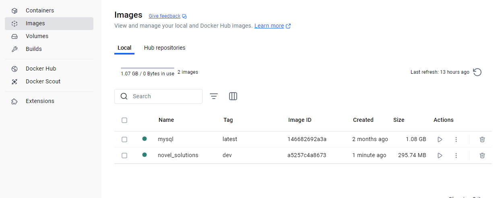

## Docker Instructions

### Starting the application/spinning up the container
1. Install Docker Desktop for your operating system
https://www.docker.com/products/docker-desktop/
2. Install Visual Studio Code Docker Extension
- On the left bar within Visual Studio Code select extensions and type in Docker within the search bar.

- Install the Docker extension by microsoft.

3. Start docker desktop
4. Go to the docker-compose.yml file within the Repository directory in VS code
5. Right click within the docker-compose.yml file and select "compose-restart"

Docker should start the build and then start the container
6. Within Docker desktop select containers in the top left bar

There should be a container running named novel_solutions
7. click the novel_solutions name
This will display the container's terminal 

Your container is now running and the application is reachable in a browser locally at http://127.0.0.1:5000

### Stopping the container and cleaning up old builds
1. Press the stop icon above the terminal. 
Be sure to stop the container after your done as to not take up your computer's resources.
I reccomend deleting the container after every run as each update of the program within VS code this container will be an old build.

2. Clean up old builds 
Each time you compose-restart a new build is created in docker desktop 
After each run I also delete these builds as they are old.
Select the "builds" tab on the left within docker desktop
delete the Novel_solutions build with the trashcan icon on the right.
