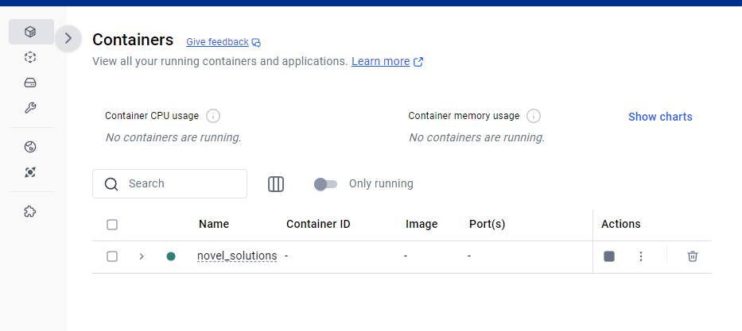
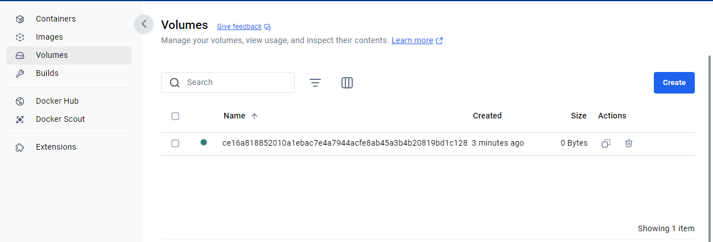

# Starting the Application / Spinning up the Container

### 1. Install Docker Desktop
- Download and install Docker Desktop for your operating system from [Docker's official website](https://www.docker.com/products/docker-desktop/).

### 2. Install the Visual Studio Code Docker Extension
- Open Visual Studio Code and go to the Extensions view by selecting the Extensions icon in the left sidebar.
- Search for "Docker" in the Extensions search bar.
- Install the Docker extension by Microsoft.

   

### 3. Start Docker Desktop
- Launch Docker Desktop on your machine.

### 4. Pull the MySQL Image
- In the Docker Desktop search bar, type `mysql`.
- Click the "Pull" button to download the MySQL image used within the Docker Compose setup.

   

### 5. Open the `docker-compose.yml` File
- In VS Code, navigate to the `docker-compose.yml` file in your project directory.
- Right-click on the file and select **Compose Restart**.

   Docker will start the build process and initialize the container.

   

### 6. Check the Running Container
- In Docker Desktop, select **Containers** from the top left bar.
- Look for a container named `novel_solutions`. Once found, click on it.

   

### 7. Access the Container Terminal
- After selecting the container, you should be able to access its terminal.

   

### 8. Access the Application
- The application will now be accessible in your browser at: `http://127.0.0.1:5000`.

---

### Container and Image Management

#### Docker Desktop Interface
- In Docker Desktop, you can see both **Images** and **Volumes**.
- Under **Images**, you will find both the `novel_solutions` image and the MySQL image used for the container’s database.

   

- Under **Volumes**, you will find the volume created for the database.

   

> **Note**: Each time you perform a `compose-restart` or create a new build, a new database is created. The database is persistent only for the current container build. If you stop and restart the container, it will continue to use the same database.

---

### Stopping the Container and Cleaning Up Old Builds and Volumes

#### 1. Stop the Container
- Press the **Stop** icon above the terminal to stop the container once you're done using it.
- **Recommendation**: Delete the container after every run to prevent old builds from lingering.

   

#### 2. Clean Up Old Builds
- Each time you perform a `compose-restart`, a new build is created in Docker.
- To clean up old builds, go to the **Builds** tab in Docker Desktop and delete the `novel_solutions` build by clicking the trashcan icon next to it.

   

#### 3. Clean Up Old Volumes
- **Warning**: Only delete volumes if you're sure you're done with that version of the container.
- Go to the **Volumes** tab in Docker Desktop, select the volume, and click **Delete**.

   

- If you have multiple volumes, you can select them by checking the checkboxes, and then click **Delete** at the top.

   

---

This process will allow you to manage containers, clean up old resources, and ensure that you're always working with the latest version of the application.
