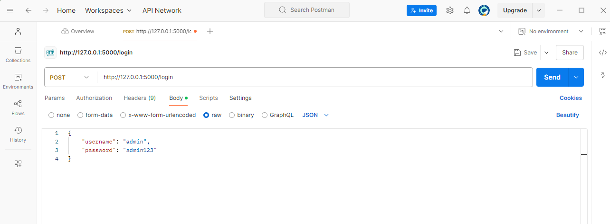

# Postman/Backend API instructions

1.
    Ensure the application is running on your local machine.
    Install Postman desktop application
    Open Postman

2.  Click the + button on Postman

#### Make a GET request to the home page to ensure the application is running 
3. Select "GET" from the dropdown menu and type your localhost url http://127.0.0.1 as well as the port the application is running on ":5000"

4. Press the "Send" Button

If the  application is running you should receive a response in
    JSON: "message" : "Home"

#### Make a POST request to login 

5. Select "POST" from the dropdown menu and change the url to http://127.0.0.1:5000/login
6. Select the "raw" radio button and ensure JSON is select to the right
7. add in JSON format to the text for the username and password of the admin account (or another account if it is already within your database)
{
    "username": "admin",
    "password": "admin123"
}

8. press send
9. You should receive a message response in JSON "Login Successful" 

10. To logout simply change the url to /logout and press send (you don't need the JSON username and password in the body to logout) 

#### POST - create a new user

11. change the url to http://127.0.0.1:5000/add_user
12. make sure POST is selected
13. add JSON formatted data with a username, password, email, firstname, lastname, and role to the body

14. press send (you will need to be logged in with a manager account to create a user)

### POST - search book/add book to database

12. change the url to http://127.0.0.1:5000/add_book 
13. add Json formatted data with isbn, stock, and price of the book

14. press send

